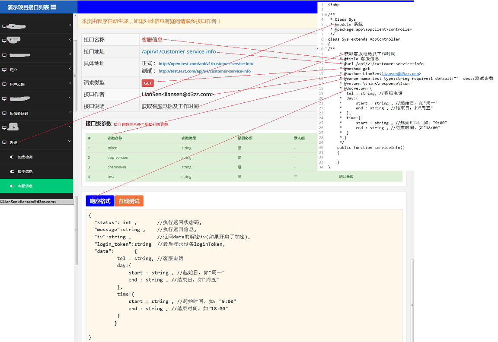

<h1>程序说明</h1>

本程序实现原理是通过扫描项目源码文件（同时支持通过SSH方式读取远程源码），项目源码中的注释文档生成在线接口文档。

支持多个项目多个模块，通过增加在conf目录下增加conf\Base的子类增加需要管理的项目。

注意： 
     如果需要接口在线测试功能，需要PHP安装了curl扩展
     
     如果需要使用ssh管理远程源码生成文档，需要保证根目录下的ssh-read*程序能够运行。这个程序是使用golang写的，源码在ssh-read-src下

文档生成说明

接口源码注释说明
文档生成说明

具体配置项目参见 conf::Base类注释
~~~
namespace conf;

/**
 * <pre>
 * 接口项目配置基类
 * 接口文档访问url形式为： http[s]://your_doamin/项目类名/模块名
 * e.g.
 * 假设
 *      你本项目部署的域名是 http://test.com
 *      你在conf目录下有一个配置类为： Test
 *                                      Test::$modules = [
 *                                          'default' => '/src/app/controller'
 *                                          'admin'   => '/src/admin/controller'
 *                                      ]
 *
 * 那么 default模块接口文档访问地址为：http://test.com/test
 *      admin  模块接口文档访问地址为：http://test.com/test/admin
 *
 * Class Base
 * @package conf
 */
abstract class Base
{

    /**
     * 源码读取方式
     * local: 本地源码(和本项目在同一服务器，并且具有源码目录读取权限)
     * ssh  : ssh远程源码(可以通过ssh登录的服务器，并且ssh用户具有源码目录读取权限)
     * @var string
     */
    protected $readType = 'local';

    /**
     * 源码远程服务器ssh登录信息
     * @var array
     */
    protected $sshInfo  = [
        'host' => '',
        'port' => '',
        'user' => '',
        'password' => '',
    ];

    /**
     * 文档用户实际接口调用服务器
     * @var array
     */
    protected $serverInfo = [
        'product_server' => '', //正式服务器地址
        'test_server'    => '', //测试服务器地址
    ];

    /**
     * 源码根目录(本地方式并且模块源码使用正则指定时使用)
     * @var string
     */
    protected $root = '';

    /**
     * <pre>
     * 当前接口项目的模块列表
     * e.g.
     * [
     *   'default' => '/src/app/controller'     //default是当访问的url缺省模块名时使用配置
     *   'admin'   => '/src/admin/controller'   //假设有一个admin模块
     * ]
     * @var array
     */
    protected $modules = [];

    /**
     * <pre>
     * Base::$modules中指定的模块隐射的名字
     * e.g.
     * [
     *   'default' => 'xxx项目'
     *   'admin'   => 'xxx项目管理后台'
     * ]
     * @var array
     */
    protected $moduleNames = [];

    /**
     * <pre>
     * 模块文档首页显示的“系统级全局请求参数”
     * 全局性质(应用系统级)的接口请求参数
     * 当没有系统级参数时，可以不设置
     * e.g.
     * 某系统接口请求格式统一为 xxx.com/api?method=yyyy&data=zzzz,
     * 比如一个用户信息获取接口可能是这样的：
     * http://open.test.com/api?method=getUserById&data={"userId":123}
     * 在这样一个系统中，method和data即为系统级参数，
     * 因为要调用的接口是通过method指定，业务参数通过data指定，格式是固定的
     * 所以我们可以将method和data如下定义
     *  [
     *       [
     *          'name'    => 'method'  ,
     *          'require' =>  1        ,                //是否必填参数(1=是，0=否)
     *          'type'    => 'string'  ,                //数据类型(将会直接显示在对应的参数类型列，
     *                                                 //没有限制写法。但建议遵循通俗的类型描述，
     *                                                 //如 string, int, float..等)
     *
     *          'default' => '无'     ,                //告诉用户不填写该参数时，该参数的默认值
     *          'desc'    => '调用的接口名称' ,        //参数说明
     *      ],
     *     [
     *          'name'    => 'data'   ,
     *          'require' =>  1       ,
     *          'type'    => 'string' ,
     *          'default' => '无'     ,
     *          'desc'    => '接口所需业务参数' ,
     *      ]
     * ]
     * @var array
     */
    protected $globalAppParams = [ ];

    /**
     * <pre>
     * 模块文档首页显示的“接口级全局请求参数”
     * 比如任意接口调用都需要对用户进行一个token身份验证，则可以配置token参数为系统级参数
     *  e.g.
     *  [
     *       [
     *          'name'    => 'token'  ,
     *          'require' =>  1       ,                //是否必填参数(1=是，0=否)
     *          'type'    => 'string' ,                //数据类型(将会直接显示在对应的参数类型列，没有限制写法。但建议遵循通俗的类型描述，如 string, int, float..等)
     *          'default' => '无'     ,                //告诉用户不填写该参数时，该参数的默认值
     *          'desc'    => '用户身份认证token' ,     //参数说明
     *      ],
     *      ... //其他接口级参数
     * ]
     * @var array
     */
    protected $globalApiParams = [ ];

    /**
     * 应用说明
     * @var string
     */
    protected $globalDesc      = '';

    /**
     * <pre>
     * 系统接口返回格式说明
     * e.g.
     * {
     *  "status": int ,       //执行返回状态码,
     *  "message":string ,    //执行返回信息,
     *  "data":mixed          //具体接口返回的业务数据
     *  }
     * @var string
     */
    protected $responseDesc    = '';

    /**
     * 返回格式
     * @var string
     */
    protected $responseFormat  = '';

    /**
     * 获取源码读取方式
     * @return string
     */
    public function getReadType()
    {
        return $this->readType;
    }

    /**
     * 获取ssh登录信息
     * @return array
     */
    public function getSshInfo()
    {
        return $this->sshInfo;
    }

    /**
     * 获取源码根目录
     * @return string
     */
    public function getRoot()
    {
        return $this->root;
    }

    /**
     * 获取应用说明
     * @return string
     */
    public function getGlobalDesc()
    {
        return $this->globalDesc;
    }

    /**
     * 获取响应格式说明
     * @return string
     */
    public function getResponseDesc()
    {
        return $this->responseDesc;
    }

    /**
     * <pre>
     * 格式化docreturn内容
     * 可以通过该方法返回具体的docreturn内容
     * 一般的我们系统的响应格式是固定的，所以在docreturn注释中只需要写当前接口的数据返回内容
     * 然后本框架会将这个内容拼接到整个系统返回（Base::$responseDesc）中
     * <pre>
     * 系统接口返回格式
     * e.g.
     * {
     *  "status": int ,       //执行返回状态码,
     *  "message":string ,    //执行返回信息,
     *  "data":mixed          //具体接口返回的业务数据
     *  }
     * 那么可以通过本方法对注释进行格式化后，填充到data字段，从而获得一个完整的接口响应说明
     * @param array $data 源码注释中的docreturn内容行数组
     * @return string
     */
    public function getResponseFormat($data = [])
    {
        return $this->responseFormat;
    }

    /**
     * 获取模块源码设置的路径
     * @param string $mod 模块名
     * @return mixed|null
     */
    public function get($mod)
    {
        return isset($this->modules[$mod]) ? $this->modules[$mod] :null;
    }

    /**
     * 获取模块显示的名称
     * @param $mod
     * @return mixed|null
     */
    public function getModName($mod)
    {
        return isset($this->moduleNames[$mod]) ? $this->moduleNames[$mod] :null;
    }

    /**
     * 获取接口服务器地址
     * @param string $key        接口服务器数组键名
     * @return array|mixed|null
     */
    public function getServerInfo($key = '')
    {
        if($key)
            return isset($this->serverInfo[$key]) ? $this->serverInfo[$key]:null;
        return $this->serverInfo;
    }

    /**
     * 获取系统级参数数组
     * @return array
     */
    public function getGlobalAppParams()
    {
        return $this->globalAppParams;
    }

    /**
     * 获取接口级参数数组
     * @return array
     */
    public function getGlobalApiParams()
    {
        return $this->globalApiParams;
    }

    /**
     * <pre>
     * 将接口测试的参数转换成对应系统api参数格式
     * 比如某些系统可能需要对请求参数进行加密
     * 那么覆写本方法，对传入的参数数组进行转换加密成所需的格式
     * e.g.
     * 对传入参数json编码后加密，最后返回固定的格式
     *  function($params){
     *      $iv = '';
     *      for ($i = 0;$i<16;$i++){
     *          $iv .= mt_rand(0,9);
     *      }
     *      $sslKey = '11112121212212121';
     *      $data = json_encode($params,JSON_UNESCAPED_UNICODE);
     *      $iv = $this->getIv();
     *      return [
     *          'data' => base64_encode(openssl_encrypt($data,'AES-256-CBC',$sslKey,OPENSSL_RAW_DATA ,$iv)),
     *          'iv'  => $iv];
     *
     * }
     * @param array $params api调用测试传递的请求参数
     * @return mixed
     */
    public function getApiRequestParams($params = [])
    {
        return $params;
    }

    /**
     * <pre>
     * 获取接口测试响应数据
     * 比如接口服务器返回的加密数据我们可能需要对其解密，以便接口测试界面阅读
     * e.g.
     * function getApiResponse($response)
     * {
     *   try{
     *       $json = json_decode($response);
     *       if(!$json){
     *           return $response;
     *       }
     *      $data = openssl_decrypt(base64_decode($json->data),'AES-256-CBC',$sslKey,OPENSSL_RAW_DATA,$json->iv);
     *      $json->data = json_decode($data);
     *      return json_encode($json,JSON_UNESCAPED_UNICODE);
     *  }catch (\Exception $e){
     *      return $response;
     *  }
     * }
     * @param $response
     * @return mixed
     */
    public function getApiResponse($response){
        return $response;
    }

}
~~~

##注释语法示例

|注释标签    | 说明                             |注释对象| 
| @module    | 设置接口归属模块(在线文档的目录) | class, function| 
| @url       | 设置接口地址                     | function| 
| @method    | 设置请求方式（GET,POST...）      | function| 
| @author    | 设置接口作者                     | function| 
| @param     | 设置接口参数                     | function| 
| @docreturn | 设置接口返回说明                 | function| 
~~~
<?php

/**
 * Class Sys
 * @module 系统
 * @package app\appclient\controller
 */
class Sys extends AppController
{
/**
     * 获取客服电话及工作时间
     * @title 客服信息
     * @url /api/v1/customer-service-info
     * @method get
     * @author LianSen<liansen@d3zz.com>
     * @param name:test type:string require:1 default:""  desc:测试参数
     * @return \think\response\Json
     * @docreturn {
     *  tel : string, //客服电话
     *  day:{
     *      start : string , //起始日，如"周一"
     *      end : string , //结束日，如"周五"
     *  },
     *  time:{
     *      start : string , //起始时间，如："9:00"
     *      end : string , //结束时间，如"18:00"
     *  }
     * }
     */
    public function serviceInfo()
    {

    }
}

~~~
